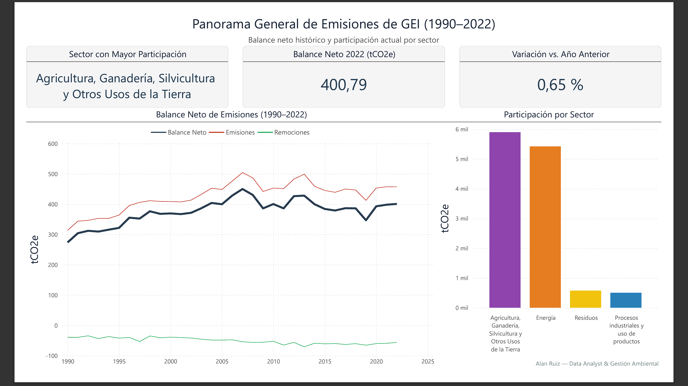
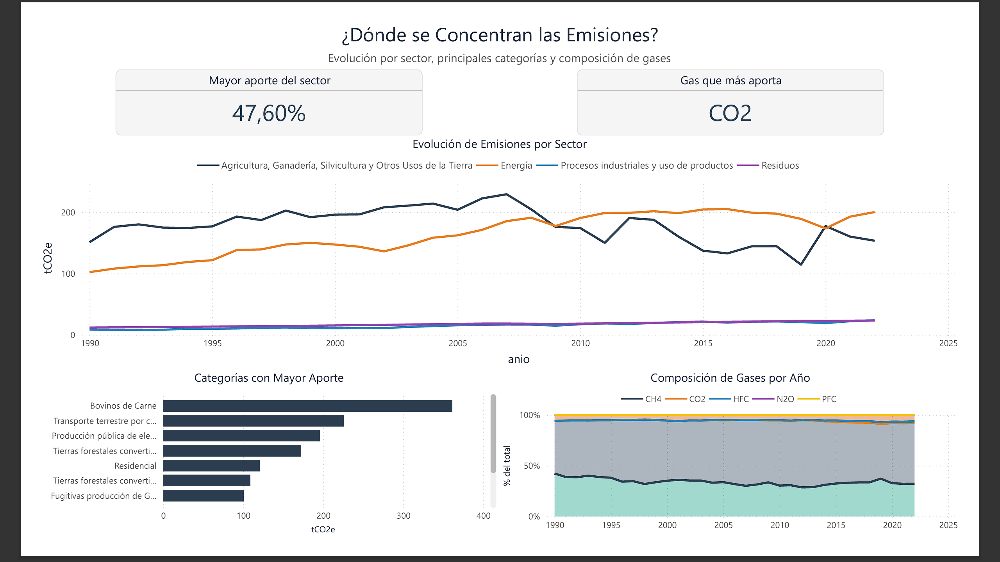
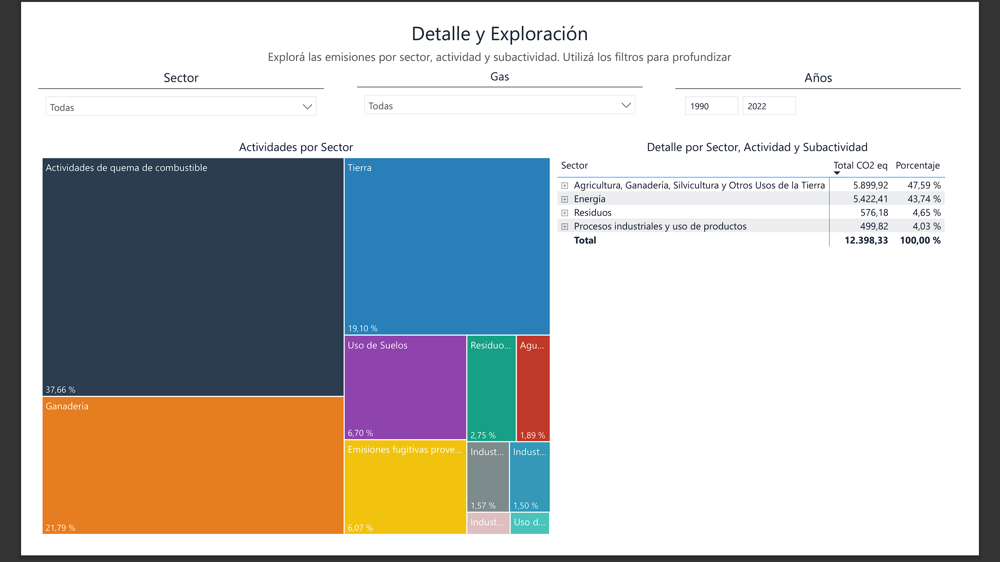
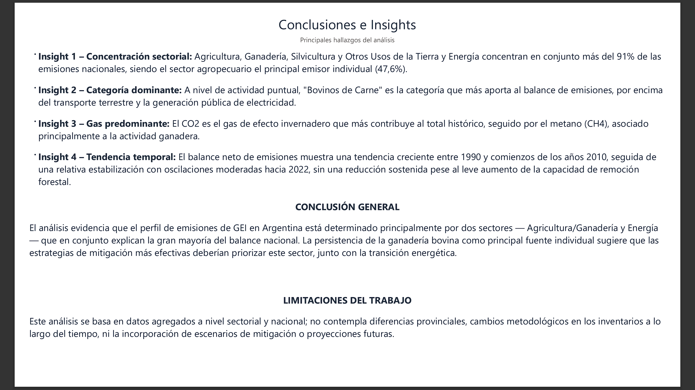

# 🌍 Emisiones de Gases de Efecto Invernadero en Argentina  
### Análisis de datos end-to-end: Python + SQL + Power BI

---

## 📌 Descripción

Este proyecto desarrolla un análisis integral de las emisiones de Gases de Efecto Invernadero (GEI) en Argentina entre 1990 y 2022, identificando qué sectores, actividades y gases concentran el mayor impacto en el balance nacional.

Se implementa un pipeline completo de datos (**end-to-end**) que incluye:

- Limpieza y transformación de datos (Python)  
- Modelado estructurado (SQLite)  
- Visualización e interpretación (Power BI)  

El enfoque combina herramientas de Data Science con criterios de gestión ambiental para generar insights aplicables al análisis de política climática.

---

## 🎯 Objetivos

- Analizar la evolución histórica del balance neto de emisiones (1990–2022)  
- Identificar los sectores y actividades con mayor participación en las emisiones  
- Evaluar la composición y peso relativo de cada gas de efecto invernadero  
- Explorar el detalle sectorial mediante navegación jerárquica (sector → actividad → subactividad)  
- Diseñar un dashboard interactivo para análisis en BI  

---

## 🔄 Metodología

**1. Procesamiento de datos (Python)**  
- Limpieza y tratamiento de valores faltantes  
- Corrección de formato numérico (separador decimal)  
- Transformación y unificación de las tablas fuente  

**2. Modelado de datos (SQLite)**  
- Diseño de esquema relacional tipo estrella  
- Creación de tablas dimensión (sector, gas, año)  
- Vistas analíticas para balance neto y participación sectorial  

**3. Visualización (Power BI)**  
- Desarrollo de dashboard interactivo con medidas DAX personalizadas  
- Análisis exploratorio y descriptivo por sector, actividad y gas  
- Identificación de patrones e insights  

---

## 📈 Resultados principales

- Agricultura, Ganadería, Silvicultura y Otros Usos de la Tierra y Energía concentran en conjunto más del 91% de las emisiones nacionales (47,6% y 43,7% respectivamente)  
- El CO2 es el gas que más contribuye al total histórico  
- "Bovinos de Carne" es la categoría individual de mayor aporte, por encima del transporte terrestre y la generación pública de electricidad  
- El balance neto de emisiones muestra una tendencia creciente entre 1990 y comienzos de los años 2010, con relativa estabilización hacia 2022  

---

## 📊 Dashboard (Power BI)

El dashboard se estructura en cuatro secciones:

- **Panorama general**  
- **Concentración de emisiones por sector, actividad y gas**  
- **Detalle y exploración sectorial**  
- **Insights y conclusiones**  

### 🖼️ Visualizaciones

#### Panorama general

#### Concentración de emisiones

#### Detalle y exploración

#### Insights

---

## 🧠 Insights clave

- El perfil de emisiones argentino está determinado principalmente por dos sectores: Agricultura/Ganadería y Energía  
- La ganadería bovina es, a nivel de actividad puntual, la principal fuente individual de emisiones  
- El CO2 predomina sobre el resto de los gases, seguido por el metano (CH4) asociado a la actividad ganadera  
- No se observa una reducción sostenida del balance neto pese al leve aumento en la capacidad de remoción forestal  

---

## ⚠️ Limitaciones

- Datos agregados a nivel sectorial y nacional (no contemplan diferencias provinciales)  
- Posibles cambios metodológicos en los inventarios a lo largo del tiempo  
- No se incorporan escenarios de mitigación ni proyecciones futuras  

---

## 💡 Valor del proyecto

Este proyecto demuestra:

- Pipeline de datos end-to-end  
- Integración Python + SQL + Power BI  
- Aplicación de criterios de gestión y análisis ambiental  
- Modelado de datos relacional para BI  
- Generación de insights accionables sobre política climática  

---

## 🛠️ Tecnologías utilizadas

- Python (Pandas, NumPy, Matplotlib)  
- SQLite  
- Power BI  
- Jupyter Notebook  

---

## 📁 Estructura del repositorio

- data/ *datos crudos y procesados*
- notebook/ *análisis exploratorio y modelado*
- sql/ *vistas analíticas en SQLite*
- dashboard/ *archivos Power BI*
- images/ *capturas del dashboard*

---

## 🚀 Próximos pasos

- Incorporar datos posteriores a 2022 a medida que se publiquen  
- Comparar el balance neto contra las metas de la Contribución Nacionalmente Determinada (NDC) de Argentina  
- Automatizar el pipeline de datos  
- Desplegar dashboard  

---

## 👤 Autor

**Alan Ruiz Diez**  
Biólogo | Data Analyst Jr. / Data Scientist Jr.  

- [LinkedIn](https://www.linkedin.com/in/alandruiz/)
- [GitHub](https://github.com/alandruiz/analisis-gei-argentina) *(actualizar con el nombre real del repositorio una vez creado)*
